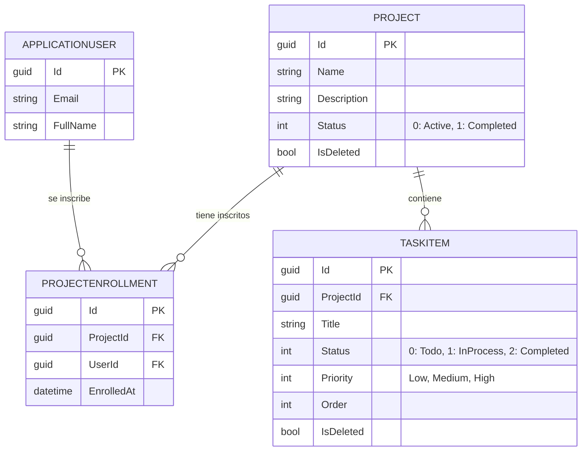

# 📖 Documento de Diseño de Software
## Sistema de Gestión de Proyectos - Assessment SENA

---

### 1. Introducción
El presente documento describe el diseño detallado del **Sistema de Gestión de Proyectos**, una aplicación web monolítica basada en ASP.NET Core MVC. El sistema permite la creación de proyectos, inscripción de usuarios y la administración granular de tareas (Kanban), garantizando la integridad de los datos mediante una arquitectura robusta y ofreciendo una experiencia visual moderna "Premium".

### 2. Descripción del Problema
En el entorno laboral e institucional, se requiere organizar tareas asociadas a proyectos específicos. Muchos sistemas dividen excesivamente el frontend y backend, aumentando la complejidad. Se necesita un sistema centralizado, monolítico y renderizado desde el servidor (Server-Side Rendering) que aplique reglas de negocio estrictas, permita a los usuarios inscribirse en proyectos y gestionar el estado de sus tareas.

### 3. Objetivos del Sistema
*   **General:** Desarrollar una plataforma integral de gestión de proyectos y tareas estructurada en capas usando .NET 8 MVC.
*   **Específicos:**
    *   Implementar autenticación segura basada en ASP.NET Core Identity (Cookies).
    *   Gestionar el ciclo de vida de los proyectos (Activos, Completados).
    *   Integrar un sistema de inscripción a proyectos por parte de los usuarios.
    *   Habilitar flujos dinámicos de cambio de estado de tareas (Por Hacer, En Proceso, Completada).
    *   Implementar borrado lógico (Soft Delete) de forma global para auditoría.

### 4. Actores y Usuarios
*   **Administrador:** Tiene permisos completos para crear, editar y eliminar proyectos y tareas, así como reordenar tareas.
*   **Usuario (Regular):** Puede visualizar proyectos activos, **inscribirse** a ellos, y **cambiar el estado** de avance de las tareas en los proyectos en los que participa.

### 5. Requerimientos
#### 5.1 Requisitos Funcionales (RF)
*   **RF1 - Autenticación y Roles:** Registro y Login nativo. Roles de "Admin" y "User".
*   **RF2 - Gestión de Proyectos:** CRUD de proyectos. Activación y finalización.
*   **RF3 - Inscripción (Enrollment):** Un usuario puede auto-inscribirse en proyectos activos garantizando relaciones únicas.
*   **RF4 - Gestión de Tareas:** CRUD de tareas asociadas a proyectos con prioridades y orden posicional.
*   **RF5 - Progreso de Tareas:** Los usuarios inscritos pueden cambiar el estado de las tareas (`Todo`, `InProgress`, `Completed`).

#### 5.2 Requisitos No Funcionales (RNF)
*   **RNF1 - Arquitectura Monolítica:** Renderizado de vistas con Razor (`.cshtml`), evitando llamadas AJAX directas a APIs externas de dominio cruzado.
*   **RNF2 - Diseño de Interfaz:** Interfaz de Usuario "Premium" (Dark theme, Glassmorphism, animaciones CSS fluidas).
*   **RNF3 - Clean Architecture:** Separación en Domain, Application, Infrastructure y Web API/MVC.
*   **RNF4 - Persistencia Relacional:** Entity Framework Core sobre PostgreSQL (Supabase).

### 6. Arquitectura de la Solución
Construida bajo **Arquitectura Limpia (Clean Architecture)**:

1.  **Dominio (Domain):** Definición de Entidades (`Project`, `TaskItem`, `ProjectEnrollment`) y enumeraciones (`TaskProgressStatus`, `ProjectStatus`).
2.  **Aplicación (Application):** Lógica y casos de uso en *Services* (`ProjectService`, `TaskService`), e interfaces.
3.  **Infraestructura (Infrastructure):** Configuración EF Core `AppDbContext`, migraciones.
4.  **Capa Web/MVC (Api):** Controladores Web (Controllers que heredan de `Controller`), Vistas Razor (`Views/`), *Model Binding* y Cookies de autenticación.

### 7. Modelo de Base de Datos (Entity-Relationship)
A continuación el modelo relacional del sistema:

### 8. Prototipo de Interfaz de Usuario
El sistema ha sido diseñado priorizando una experiencia de usuario oscura de alto nivel (*Premium UI*).
Se incluyen las siguientes pantallas y componentes principales:
*   **Módulo Autenticación:** Formularios centralizados en tarjetas *Glassmorphism* (Login/Register).
*   **Listado de Proyectos:** Tarjetas interactuables con barras de progreso calculadas dinámicamente y botones reflexivos para Inscripción.
*   **Lista de Tareas (Kanban list):** Listado con medallas dinámicas de colores para estados (`Por Hacer`, `En Proceso`, `Completada`) y *dropdowns* de formularios embebidos sin recargar manualmente AJAX.

### 9. Justificación Técnica
*   **ASP.NET Core MVC (Monolito):** Se eligió esta arquitectura tradicional y consolidada para simplificar la barrera mental del desarrollador en despliegue y SEO, delegando el estado de UI al servidor confiable.
*   **Identity con Cookies:** Es mucho más seguro por defecto contra ataques XSS en arquitecturas monolíticas web que usar `JWT` guardados el *Local Storage*.
*   **PostgreSQL:** Un motor relacional sólido para soportar los índices únicos cruzados de `ProjectEnrollment` y borrado lógico con alto rendimiento.
