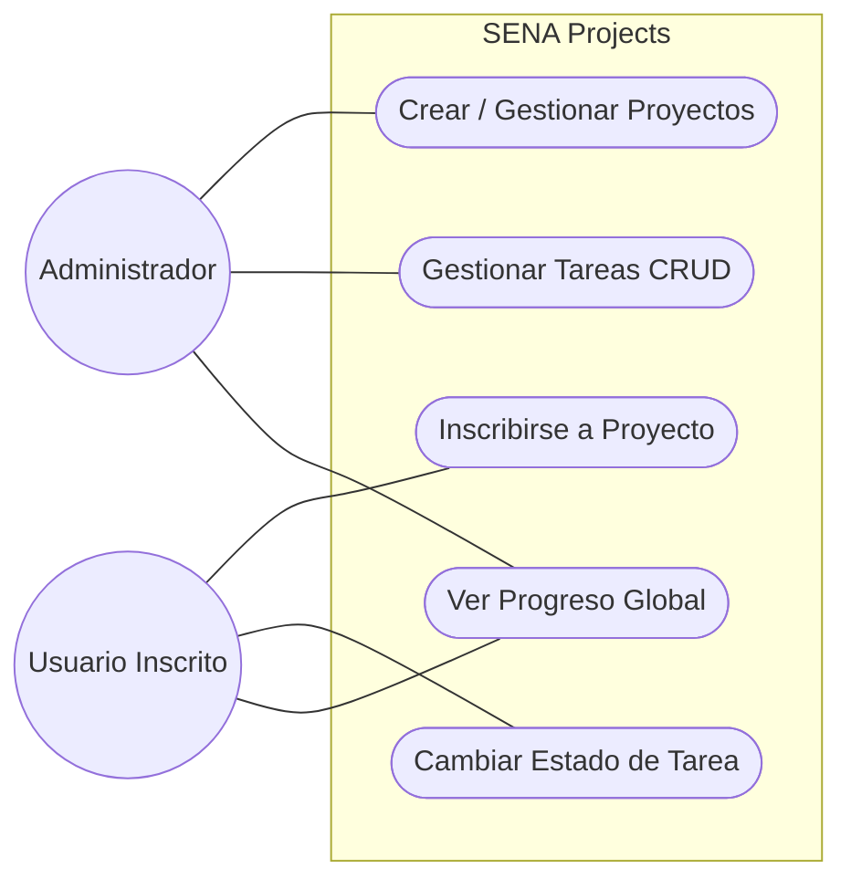
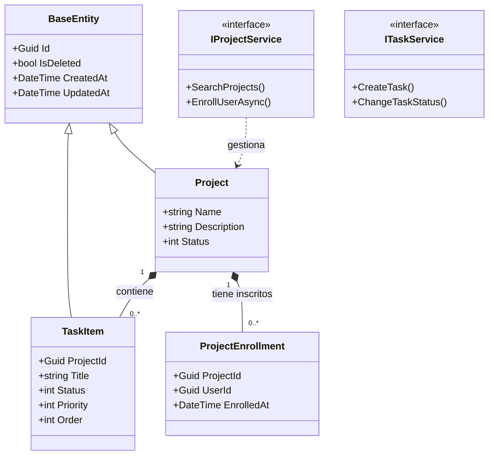
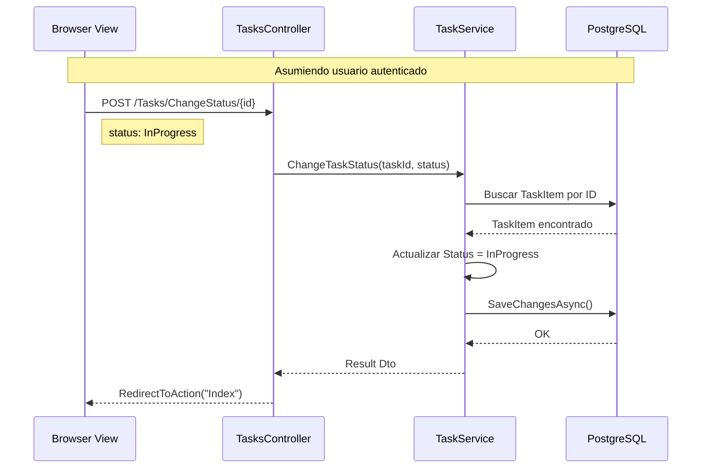
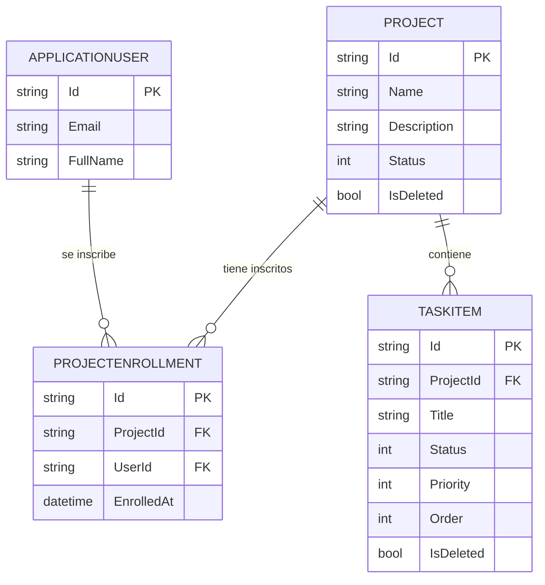

# 📊 Diagramas de Lenguaje Unificado de Modelado (UML)
## Sistema de Gestión de Proyectos - Assessment SENA

---

### 1. Diagrama de Casos de Uso
Describe las interacciones de los niveles de autorización con el sistema de Proyectos utilizando un diagrama de flujo adaptado validado para Mermaid.

### 2. Diagrama de Clases
Muestra la estructura estática y las relaciones del Modelo de Dominio de Proyectos (Sintaxis Estricta de Mermaid).

### 3. Diagrama de Secuencia (Flujo de Cambio de Tareas)
Ilustra el proceso mediante el cual un Usuario cambia un estado (Sintaxis Estricta Mermaid).

### 4. Modelo de Base de Datos (E-R)
Sintaxis válida nativa de Entidad-Relación en Mermaid (`erDiagram`).

